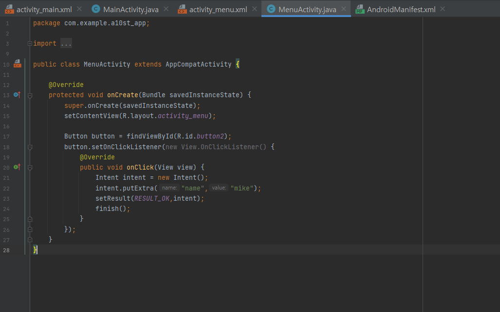

# 2주차 (2022-03-15)
- 안드로이드 스튜디오 설치 && 깃허브 가입 및 저장소 생성

</img>

# 3주차 과제

</img>
</img>
</img>

# 5주차 과제

</img>
</img>
</img>
</img>

# 6주차 과제

</img>
</img>

# 9주차 과제
</img>
</img>
</img>
</img>

# 10주차 과제
</img>
</img>
</img>
</img>

# 11주차 과제
</img>
